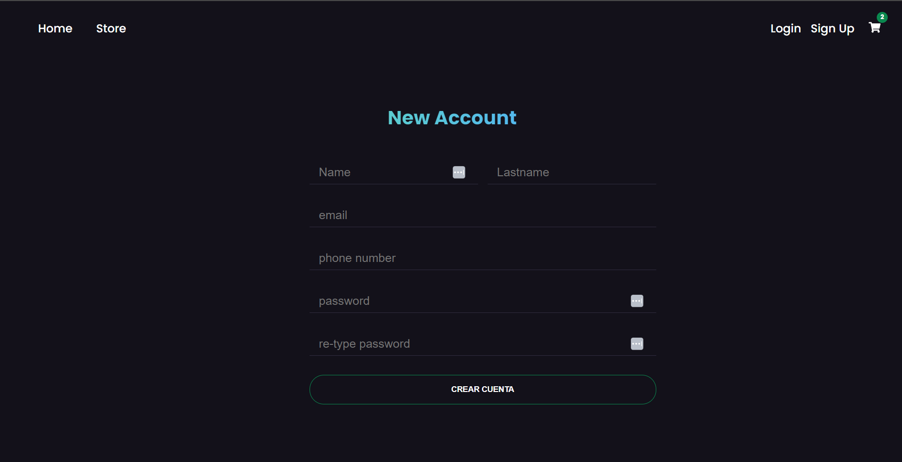
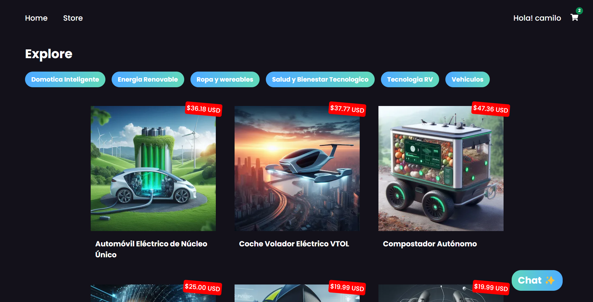
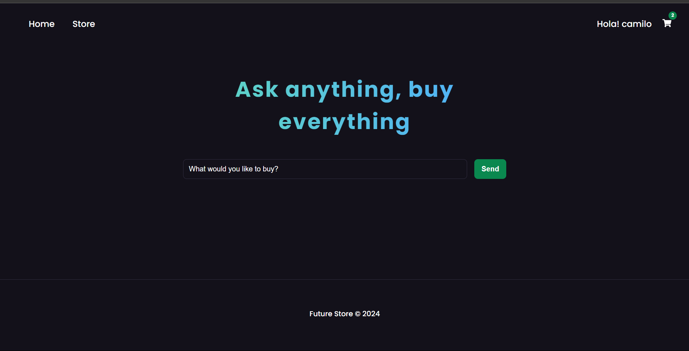
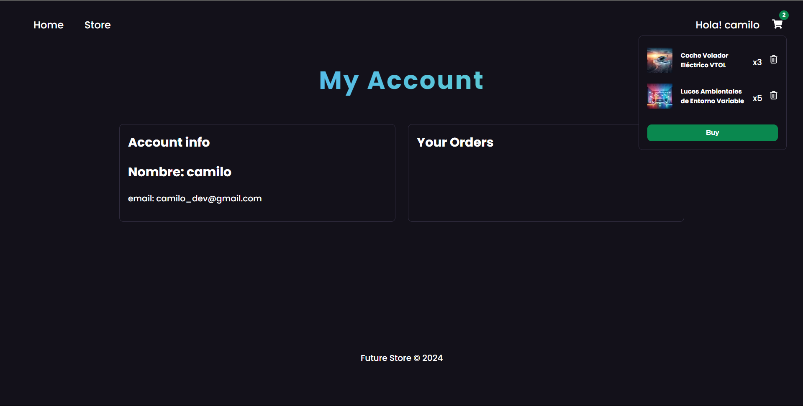

# Store Tech

Tienda en linea usando NextJS 14 para hacer pruebas con la api de shopify

### Tecnologias usadas:
- NextJs
- Reactjs
- Sass
- Graphql
- Shopify
- Api
- API Gemini - Google IA
- Zustand

----

----

---

-----
